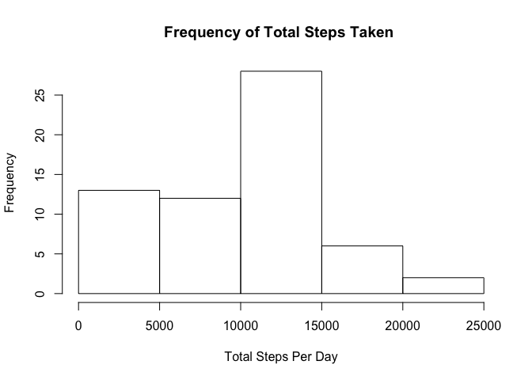
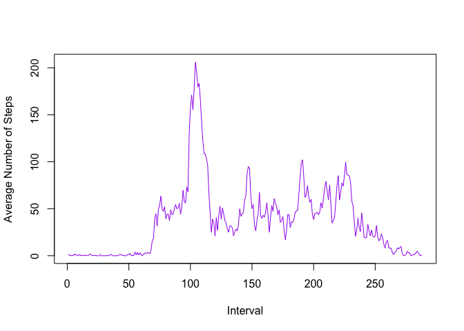
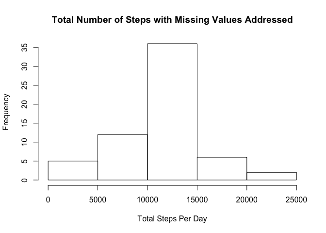
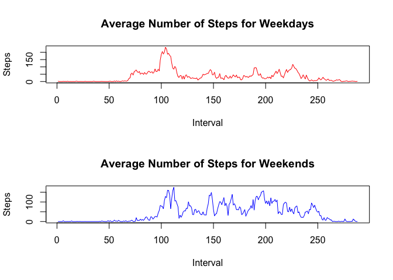

Reading in the Data
-------------------

``` r
dfActivity<-read.csv("activity.csv")
str(dfActivity)
```

    ## 'data.frame':    17568 obs. of  3 variables:
    ##  $ steps   : int  NA NA NA NA NA NA NA NA NA NA ...
    ##  $ date    : Factor w/ 61 levels "2012-10-01","2012-10-02",..: 1 1 1 1 1 1 1 1 1 1 ...
    ##  $ interval: int  0 5 10 15 20 25 30 35 40 45 ...

Mean Total Number of Steps Taken Per Day
----------------------------------------

Histogram & Mean Calculations <br /> Ignoring NAs <br />

``` r
totalSteps<-tapply(X = dfActivity$steps,INDEX = dfActivity$date,sum,na.rm=TRUE)
hist(x = totalSteps,main = "Frequency of Total Steps Taken ", xlab = "Total Steps Per Day")
```



``` r
print(paste0("Mean: ",mean(totalSteps,na.rm = T)))
```

    ## [1] "Mean: 9354.22950819672"

``` r
print(paste0("Median: ",median(totalSteps,na.rm = T)))
```

    ## [1] "Median: 10395"

Average Daily Activity Pattern
------------------------------

Time Series Plot <br /> Interval with the heighest <br />

``` r
averageSteps<-tapply(X = dfActivity$steps,INDEX = dfActivity$interval, mean, na.rm=TRUE)
plot(averageSteps,type="l",col="purple",xlab="Interval",ylab="Average Number of Steps")
```



``` r
print(paste0("Interal with the highest average number of steps: ", averageSteps[which.max(averageSteps)]))
```

    ## [1] "Interal with the highest average number of steps: 206.169811320755"

Dealing with Missing Values
---------------------------

``` r
print(paste0("Number of rows with NA's: ", sum(!complete.cases(dfActivity))))
```

    ## [1] "Number of rows with NA's: 2304"

``` r
dfActivity2<-dfActivity

## Fill in missing data with averages of the matching interval
for(i in 1:nrow(dfActivity2)){
    if(is.na(dfActivity2$steps[i])){
        for(j in 1:nrow(averageSteps)){
            if(as.character(dfActivity2$interval[i])==names(averageSteps[j])){
                dfActivity2$steps[i] = averageSteps[[j]]
            }
        }
    }
}

print(paste0("Number of rows left with NA's: ", sum(!complete.cases(dfActivity2))))
```

    ## [1] "Number of rows left with NA's: 0"

``` r
totalSteps2<-tapply(X = dfActivity2$steps,INDEX = dfActivity2$date,sum)
hist(x = totalSteps2, xlab = "Total Steps Per Day", main="Total Number of Steps with Missing Values Addressed")
```



``` r
print(paste0("Mean of original DF: ",mean(totalSteps,na.rm = T)))
```

    ## [1] "Mean of original DF: 9354.22950819672"

``` r
print(paste0("Median of original DF: ",median(totalSteps,na.rm = T)))
```

    ## [1] "Median of original DF: 10395"

``` r
print(paste0("Mean of complete DF: ",mean(totalSteps2)))
```

    ## [1] "Mean of complete DF: 10766.1886792453"

``` r
print(paste0("Median of complete DF: ",median(totalSteps2)))
```

    ## [1] "Median of complete DF: 10766.1886792453"

##### By estimating the missing values, both the mean and median increased. It also caused the histogram to boost up the middle bucket compared to the other buckets.

Differences Between Weekdays and Weekends
-----------------------------------------

``` r
dfActivity$days <- weekdays(as.POSIXlt.date(dfActivity$date))
dfActivity$daytype <- dfActivity$days

for(k in 1:nrow(dfActivity)){
    if(dfActivity$days[k] == "Saturday" || dfActivity$days[k] == "Sunday"){
        dfActivity$daytype[k] = "weekend"
    } else {
        dfActivity$daytype[k] = "weekday"
    }
}

dfActivity$daytype<-as.factor(dfActivity$daytype)


dfActivityWeekend<-subset(dfActivity,dfActivity$daytype == "weekend")
dfActivityWeekday<-subset(dfActivity,dfActivity$daytype == "weekday")

averageStepsWeekend<-tapply(X = dfActivityWeekend$steps,INDEX = dfActivityWeekend$interval, mean, na.rm=TRUE)
averageStepsWeekday<-tapply(X = dfActivityWeekday$steps,INDEX = dfActivityWeekday$interval, mean, na.rm=TRUE)

par(mfrow = c(2,1))
plot(averageStepsWeekday,type="l",col="red",xlab="Interval",ylab="Steps",main="Average Number of Steps for Weekdays")
plot(averageStepsWeekend,type="l",col="blue",xlab="Interval",ylab="Steps",main="Average Number of Steps for Weekends")
```


